autoscale: true
build-lists: true

# [fit] Mushroom classifier

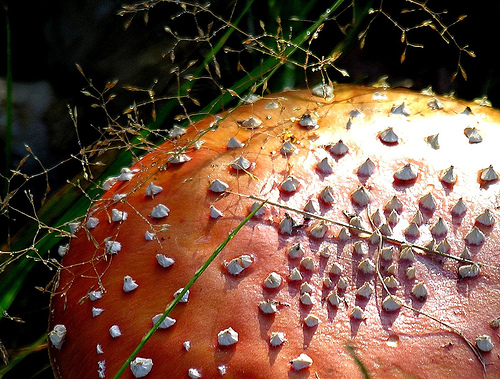 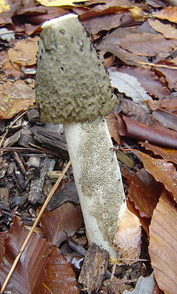 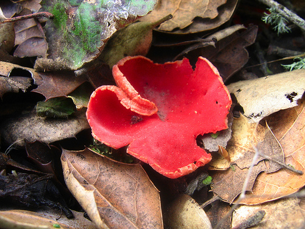 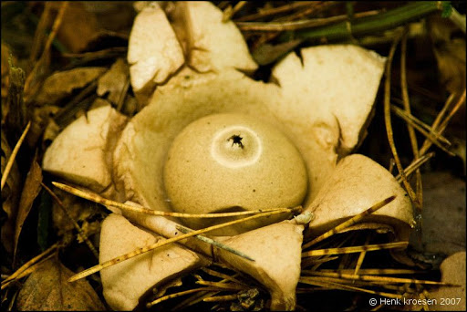 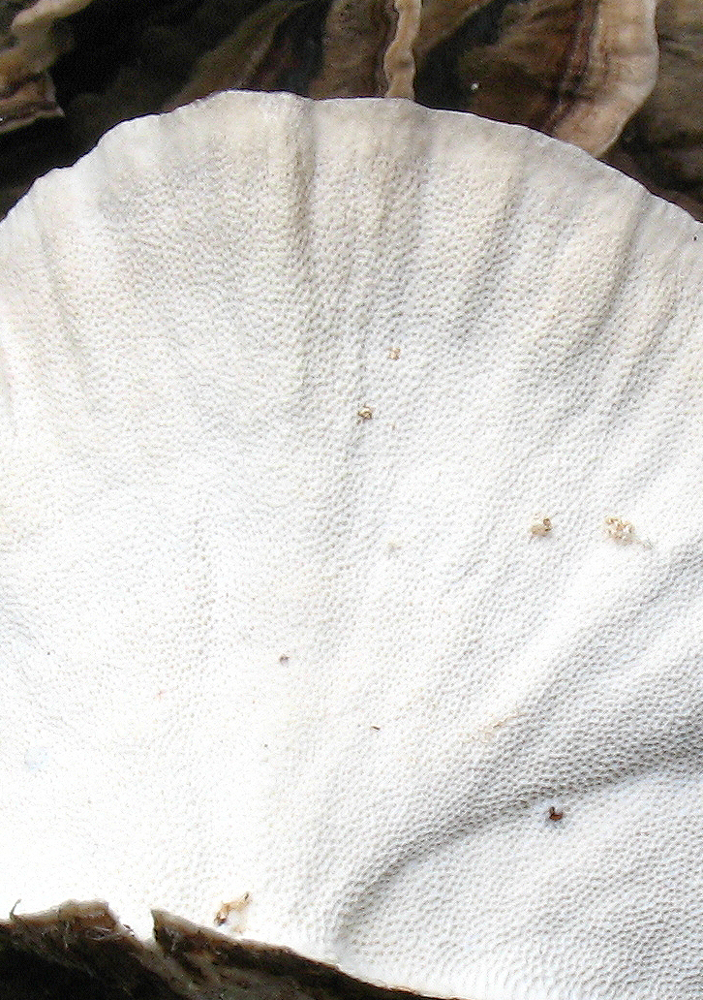

---

# Our goals

* Train a neural net model to identify 5 types of mushroom ...
* Prove that it works reasonably well
* Create an Elixir application which can run the label'er

---

# What types of mushroom will we be classifying?

---

# Fly agaric...


---

# Common stinkhorn...


---

# Scarlet elf cup...


---

# Earthstar...


---

# Giant puffball...


--


---

# [fit] Inspiration / framework


```
http://fungai.org/2017/12/13/train-a-basic-wild-mushroom-classifier/
```

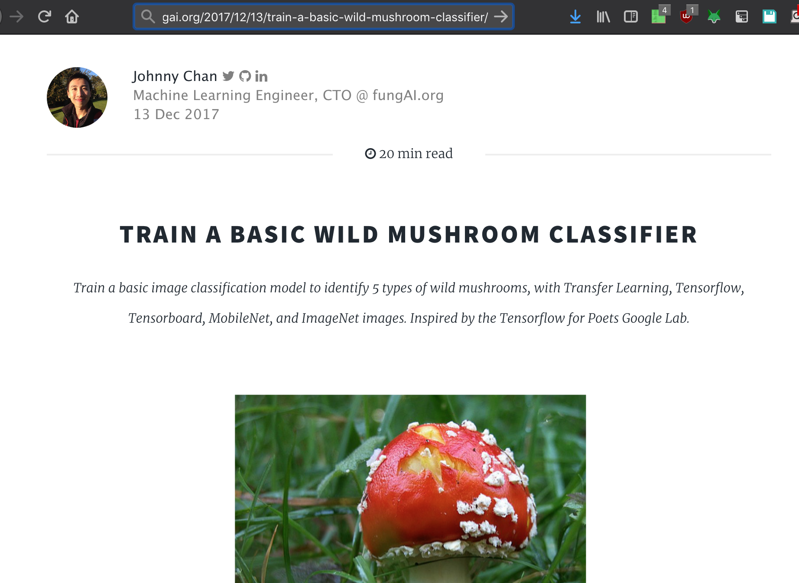

---

# Uses the Anaconda Distribution

The World's Most Popular Python/R Data Science Platform


---

# And Tensorboard/Tensorflow

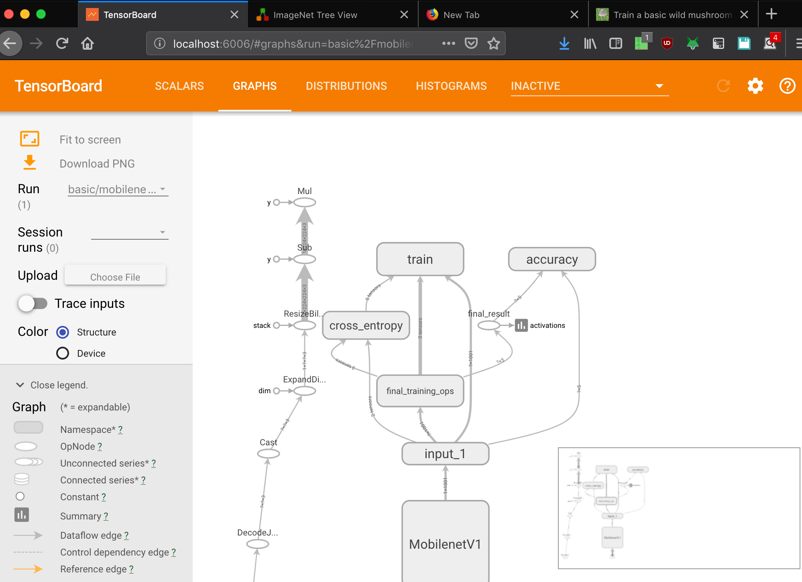

---

# Workflow 

---

## Imagenet

Browse training sets from Stanford/Princeton

(https://image-net.org/)


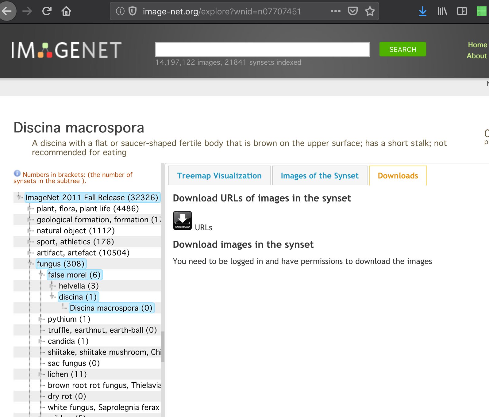

---

## Imagenet

For every set - they provide a list of image URL's 

(we download 5 categories)

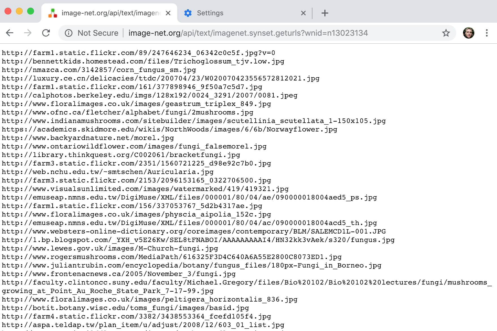

---

## Download


And manually cleanup the garbage (lots of shell commands)

```
./downloadutils.py --downloadImages --wnid n13044778
```

---

## Train

Organize into 5 sets of 180 images and run the training (takes about 4 minutes)

```
export TFP_IMAGE_SIZE="224"
export TFP_RELATIVE_SIZE="0.50"
export TFP_ARCHITECTURE="mobilenet_${TFP_RELATIVE_SIZE}_${TFP_IMAGE_SIZE}"
export TFP_IMAGES_DIR="180"

python -m scripts.retrain \
  --image_dir=tf_files/${TFP_IMAGES_DIR} \
  --bottleneck_dir=tf_files/bottlenecks \
  --model_dir=tf_files/models/ \
  --summaries_dir=tf_files/training_summaries/basic/"${TFP_ARCHITECTURE}" \
  --output_graph=tf_files/retrained_graph.pb \
  --output_labels=tf_files/retrained_labels.txt \
  --how_many_training_steps=500 \
  --architecture="${TFP_ARCHITECTURE}"
```

---

## View traing information in tensorboard 

```
(py36-tf14) $ tensorboard --logdir tf_files/training_summaries --host=localhost &
```


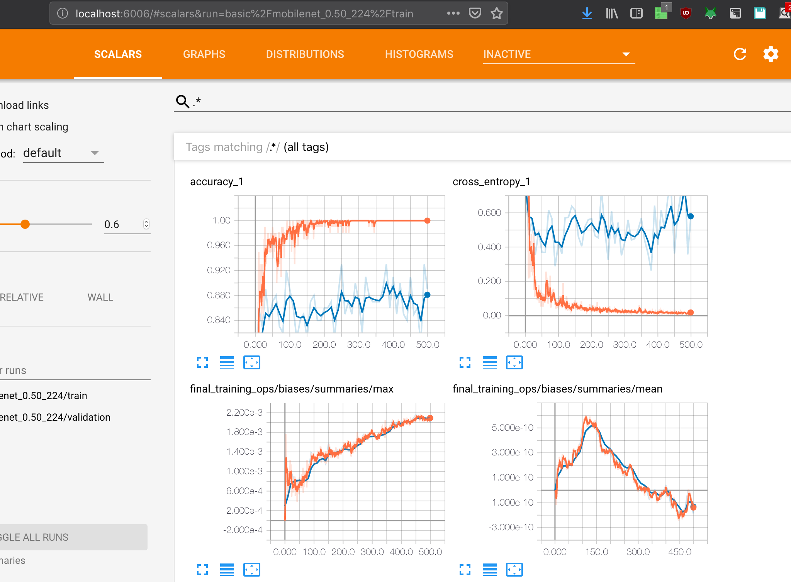


---

# Label

We ask the system to identify an image using it's trained graph ( `tf_files/retrained_graph.pb` ) 

```
python -m scripts.label_image --graph=tf_files/retrained_graph.pb --image=tf_files/20/n13044778-Earthstar/pow20000924a.jpg
Evaluation time (1-image): 0.146s

n13044778 earthstar (score=0.89511)
n13040629 common stinkhorn (score=0.10488)
n13030337 scarlet elf cup (score=0.00000)
n13003061 fly agaric (score=0.00000)
n13044375 giant puffball (score=0.00000)

```
---

# Execute the label script from outside it's directory

```
PYTHONPATH=/Users/b/repos/my-tensorflow-for-poets \
python \
-m scripts.label_image \
--graph=/Users/b/repos/my-tensorflow-for-poets/tf_files/retrained_graph.pb \
--image=/tmp/output \
--labels=/Users/b/repos/my-tensorflow-for-poets/tf_files/retrained_labels.txt
```
---


# Convert to equivalent Elxir shell command

```

System.cmd("python", [
"-m",
"scripts.label_image",
"--graph=/Users/b/repos/my-tensorflow-for-poets/tf_files/retrained_graph.pb",
"--image=/tmp/output",
"--labels=/Users/b/repos/my-tensorflow-for-poets/tf_files/retrained_labels.txt",
], env: [{"PYTHONPATH", "/Users/b/repos/my-tensorflow-for-poets/"}])
```

---

# File upload 1

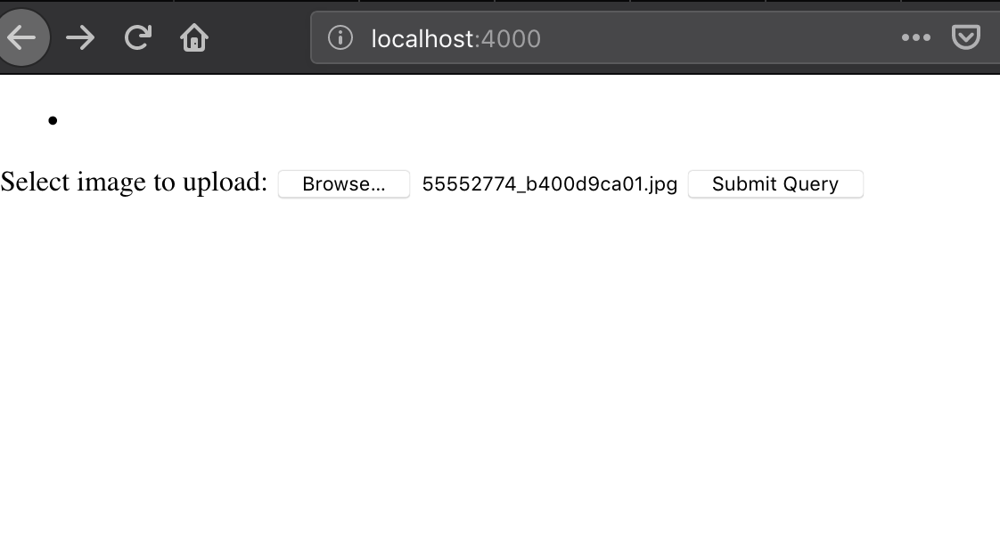

---

# File upload 2

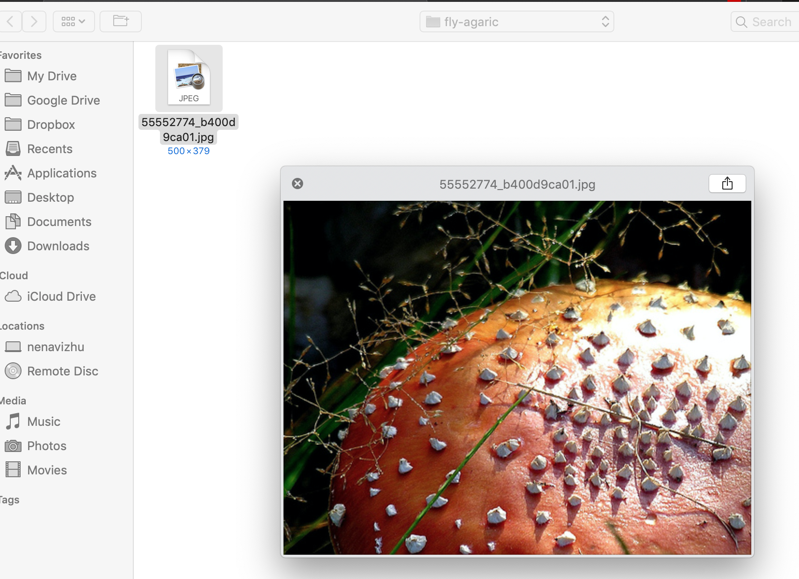

---

# File upload 3

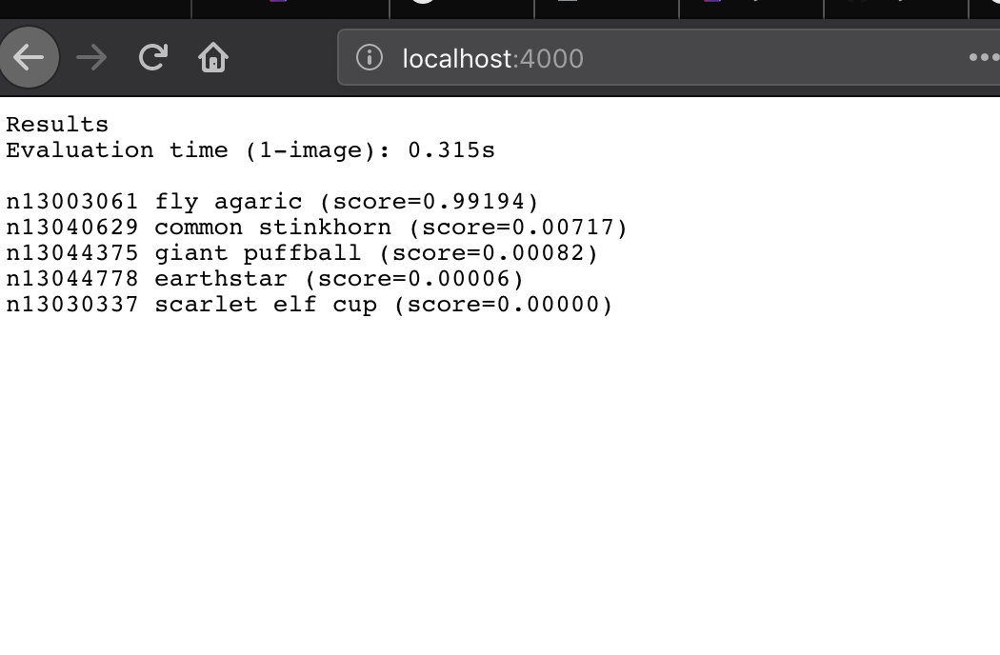

---

Thanks for watching


